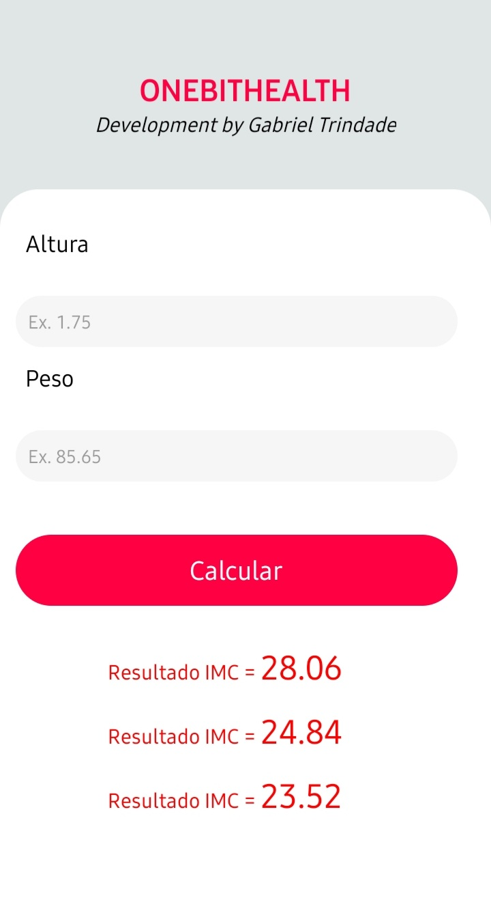

# Projeto OneBitHealth

## Objetivo

Desenvolver meus conhecimentos relacionadas à criação de aplicativos mobile com React Native.

## Tecnologias utilizadas

- React Native
- Expo 

## Telas

### Tela inicial

---

### Resultado

---

### Compartilhar resultado

---

### Lista dos resultados

## Créditos

Curso de React Native do **Canal One Bit Code**.

- [Playlist do curso](https://youtube.com/playlist?list=PLdDT8if5attEd4sRnZBIkNihR-_tE612_)
